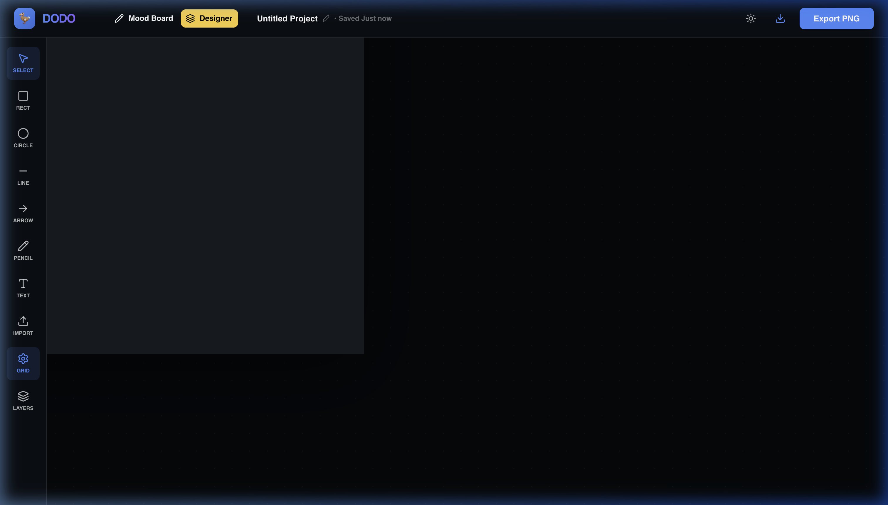
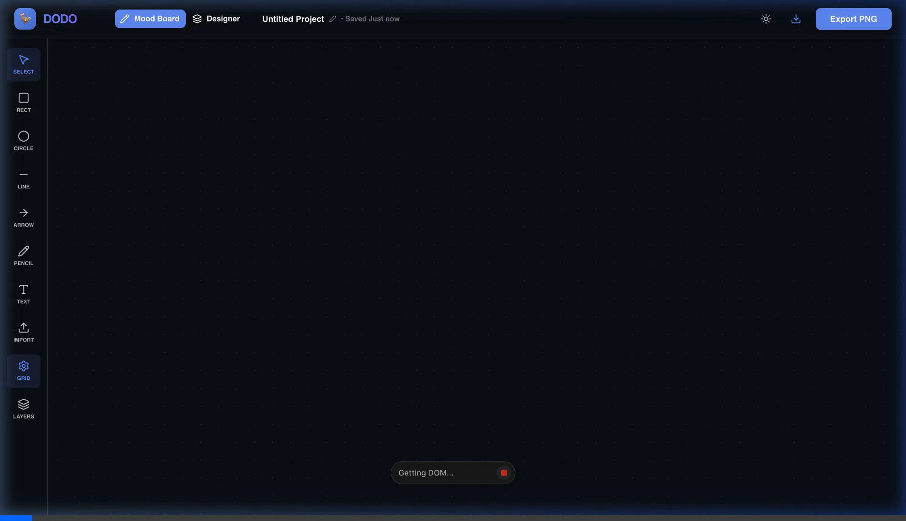

# 🎨 DODO Studio: Design Showcase

A deep dive into the high-fidelity user interface and interactive capabilities of **DODO Studio**.

## 🚀 Experience Live
**[DODO Studio Live on Vercel](https://vibecode-phi-ivory.vercel.app/)**

---

## 💎 Product Highlights

### 1. The High-Fidelity Interface
DODO Studio is designed with a "vibe-first" approach, utilizing **glassmorphism**, high-fidelity typography (Inter), and a curated dark-mode palette.

*(DODO Studio: Designer Mode)*

### 2. Dual-Mode Flexibility
Toggle seamlessly between a freeform sketching environment and a structured designer artboard.

- **Mood Board**: Hand-drawn vectors using Rough.js for rapid ideation.
- **Designer**: Pixel-perfect artboard with professional depth and grid snapping.

### 3. Professional Precision
Experience precision with lasso selection, proportional resizing, and unified group rotation.

---

## 🛠 Feature Spotlight

### 📁 Advanced Layers Management
A professional layers panel that includes:
- **Visibility & Locking**: Prevent accidental edits and manage complex hierarchies.
- **Drag-to-Reorder**: Intuitively manage the Z-index of your elements.
- **Search & Filter**: Find elements instantly in large projects.

### 🖋 Intuitive Text Tool
- Excalidraw-inspired "type anywhere" experience.
- Automatic container resizing based on content.
- Support for professional fonts (Inter).

### 📤 Asset Import
- **Image Support**: Drag and drop PNGs and JPEGs.
- **SVG Engine**: Import and transform vector graphics without quality loss.

---

## 📺 Interaction Walkthrough

Watch the design tool in action, showing the seamless flow from creation to transformation:

---

  <h3>Ready to start creating?</h3>
  
<a href="https://vibecode-phi-ivory.vercel.app/"><b>Open DODO Studio</b></a>

